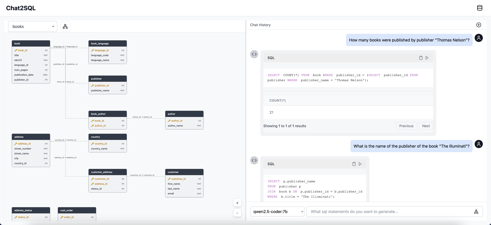

# Chat2SQL

一个基于 React 和 Node.js 的智能数据库查询助手，支持自然语言转 SQL 查询，并提供数据库表关系可视化功能。



## 功能特性

- 🔍 自然语言转 SQL：支持使用自然语言描述来生成 SQL 查询语句
- 📊 数据库可视化：自动生成数据库表关系图，直观展示表结构
- 🤖 多模型支持：集成 Ollama，支持多种 AI 模型
- 💾 数据库连接：支持 MySQL 数据库连接和管理
- 🎨 美观的界面：基于 TailwindCSS 的现代化 UI 设计
- 📝 SQL 语法高亮：集成 Prism.js 实现代码高亮
- 📋 便捷操作：支持 SQL 复制、执行等快捷功能

## 安装指南

### 前置要求

- Node.js >= 16
- MySQL 数据库 8.0.40
- Ollama
  - 从 [Ollama官网](https://ollama.com/download) 下载并安装
  - 模型：
    - [Qwen2.5-Coder](https://ollama.com/library/qwen2.5-coder)
    - [DeepSeek-Coder](https://ollama.com/library/deepseek-coder)

### 安装步骤

1. 克隆项目

2. 安装前端依赖
```bash
npm install
```

3. 安装后端依赖
```bash
cd server
npm install
```


4. 启动服务
```bash
# 启动前端服务
npm run build && npm run dev
# 启动后端服务 (新终端)
node server/index.js
```

## 使用说明

1. 连接数据库
   - 点击右上角数据库图标
   - 输入数据库连接信息
   - 选择要操作的数据库

2. 查看数据库结构
   - 连接成功后，点击"生成数据库关系图"按钮
   - 可以通过拖拽、缩放来调整视图

3. 使用自然语言查询
   - 在输入框中输入自然语言描述
   - 选择合适的 AI 模型
   - 系统会自动生成并显示对应的 SQL 语句

4. 执行查询
   - 点击生成的 SQL 语句旁的执行按钮
   - 查看查询结果

## 技术栈

### 前端
- React 18
- TypeScript
- Vite
- TailwindCSS
- React Markdown
- Prism.js

### 后端
- Node.js
- Express
- MySQL2
- WebSocket


## 版本历史

- 0.1.0 (2024-10)
  - 初始版本发布
  - 支持基本的数据库连接和查询功能
  - 实现数据库表关系可视化
  - 集成 Ollama AI 模型

## 许可证

本项目采用 MIT 许可证 - 查看 [LICENSE](LICENSE) 文件了解详情


## 参考资料

- [React 官方文档](https://reactjs.org/)
- [Express 官方文档](https://expressjs.com/)
- [TailwindCSS 文档](https://tailwindcss.com/)
- [D3.js 文档](https://d3js.org/)
- [Ollama 文档](https://ollama.ai/)
- [Ollama 下载](https://ollama.com/download)
- [BIRD 基准测试](https://bird-bench.github.io/)
- [Qwen2.5-Coder 模型](https://ollama.com/library/qwen2.5-coder)
- [DeepSeek-Coder 模型](https://ollama.com/library/deepseek-coder)
